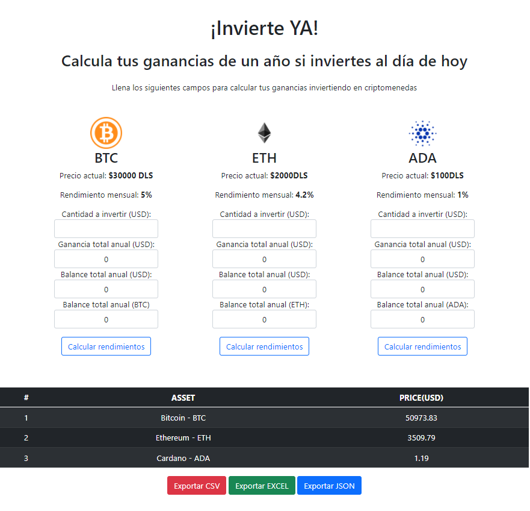

# Real-Time API Cryptomonedas usando Messuri API (Ruby on Rails)

Esta aplicación simula calcular los rendimientos anuales que se tendrían si se inviertiera en las siguientes criptomonedas (BTC, ETH, ADA) con rendimientos mensuales de (5%, 4.2%, 1%) respectivamente, también usa websockets ([ActionCable](https://guides.rubyonrails.org/v6.0/action_cable_overview.html)) para consumir una API ([rest-client](https://rubygems.org/gems/rest-client/versions/1.8.0)) en tiempo real usando funciones asíncronas, cada 120 segundos la tabla se va actualizando (prueba gratuita de [Messuri API](https://messari.io/api) permite 1000 peticiones diarias máximo). Los datos se pueden visualizar en una tabla, y estos datos también pueden ser exportados como archivos .xls, .csv, .json para su uso de manera local.

El código se encuentra comentado para su documentación técnicas y ayudar a la legibilidad del código, los comentarios  han seguido una estructura de acuerdo al uso de la gema [rdoc](https://ruby.github.io/rdoc/)

## Descargo de responsabilidad ⚠

En esta aplicación no se solicita dinero, ni es una fuente confiable para saber las ganancias reales al invertir en criptomonedas.

## Screenshots

<center>
    
</center>

## Dessarrollado con 🔨

- Ruby
- Ruby on Rails
- JavaScript
- ActionCable, rest-client & rspec.
- Bootstrap
- Visual Studio Code
- Git
- GitHub

## Linters

- Rubocop
- Stylelint

## Getting Started

Sigue los siguientes pasos para poder tener una copia de este proyecto de manera local:

### Install
- Para correr este proyecto en una máquina local, necesitas previamente instalar Ruby.
    - Para usuarios de Windows, visitar [Ruby Installer](https://rubyinstaller.org/).
    - Para usuarios de macOS y Linux, visitar [Ruby Official Site](https://www.ruby-lang.org/en/downloads/) y seguir las instrucciones de instalación.
- Una vez instalado Ruby, clona este repositorio utilizando el siguiente comando desde tu terminal ubicado desde desees conservar el repositorio:

```
git clone https://github.com/DanteAlonsoHT/group_our_transactions.git
```

### Run App

Escribe en la terminal los siguientes comandos para empezar a correr la aplicación (Recordatorio: Recuerda estar posicionado desde el directorio raíz del proyecto):

- Para instalar todas las gemas usadas en el proyecto:

```
bundle install
```

- Para abrir un servidor utilizando Rails.

```
rails server
```

- Abre una ventana en tu navegador, y dirígete a la siguiente ruta `http://localhost:3000`

### Advertencia ⚠

Si tienes el siguiente error: 

**"Webpacker::Manifest::MissingEntryError in ..."**

Corre la siguiente linea en tu terminal desde el directorio donde se encuentra alojado el repositorio.

```
rails webpacker:install
```

### Test App

Puedes testear la aplicación usando el siguiente comando.

```
bundle exec rspec
```

## Autor

👤 **Dante Alonso**

- GitHub: [@DanteAlonsoHT](https://github.com/DanteAlonsoHT)
- Twitter: [@dante_dante1](https://twitter.com/dante_dante1)
- LinkedIn: [Dante Alonso](https://www.linkedin.com/in/dante-alonso/)

## 🤝 Contribuciones

¡Contribuciones, errores, bugs, y características solicitas son bienvenidos!

Con confianza puedes solicitarlas en: [issues page](https://github.com/DanteAlonsoHT/RoR-CryptoApp-API/issues).

## Mostrar tu apoyo

Dame una ⭐️ si te gustó este proyecto!

## Agradecimientos

- A cualquiera que desee hacer uso de este repositorio 🔰
- Inspiración 💘
- [Disruptive Studio](https://www.disruptivestudio.com/) ⭐️

## 📝 Licencia

Este proyecto está licenciado con [MIT](https://opensource.org/licenses/MIT).
